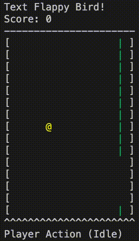

# Text Flappy Bird for OpenAI Gym

This repository contains the implementation of two OpenAI Gym learning environments of a simple unit-element player version of the Flappy Bird. The code base is heavily borrows from the [flappy-bird-gym](https://github.com/Talendar/flappy-bird-gym) repository.

It is inspired by the NetHack game and can be rendered within a terminal using simple character elements. The two environments differ only in the yielded observations. The `TextFlappyBird-screen-v0` returns the array that represents the current state of the game screen encoded as integers while the `TextFlappyBird-v0` returns the horizontal and vertical distance of the player to the closest upcoming pipe gap.



## Installation

You can install the gym using the following command:

```
pip install git+https://gitlab-research.centralesupelec.fr/stergios.christodoulidis/text-flappy-bird-gym.git
```

## Usage

```python

import os, sys
import gymnasium as gym
import time

import text_flappy_bird_gym

if __name__ == '__main__':

    # initiate environment
    env = gym.make('TextFlappyBird-v0', height = 15, width = 20, pipe_gap = 4)
    obs = env.reset()

    # iterate
    while True:

        # Select next action
        action = env.action_space.sample()  # for an agent, action = agent.policy(observation)

        # Appy action and return new observation of the environment
        obs, reward, done, _, info = env.step(action)

        # Render the game
        os.system("clear")
        sys.stdout.write(env.render())
        time.sleep(0.2) # FPS

        # If player is dead break
        if done:
            break

    env.close()
```

